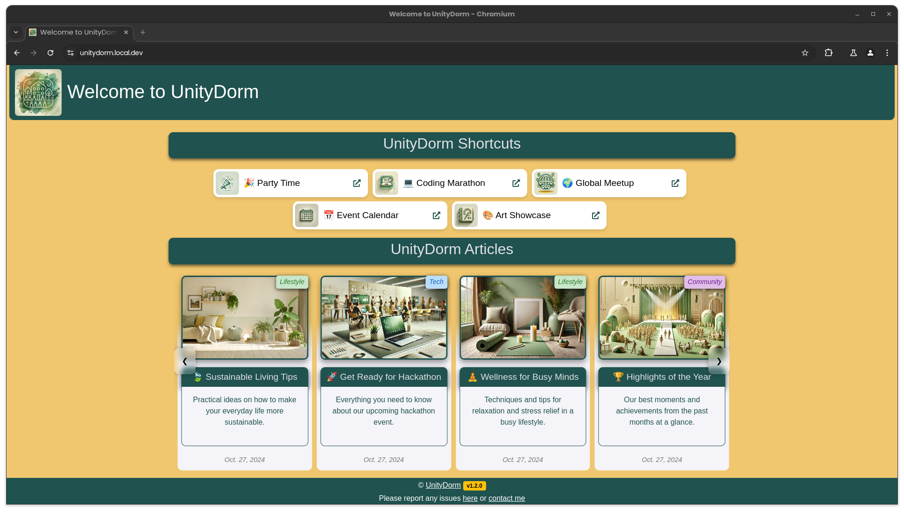
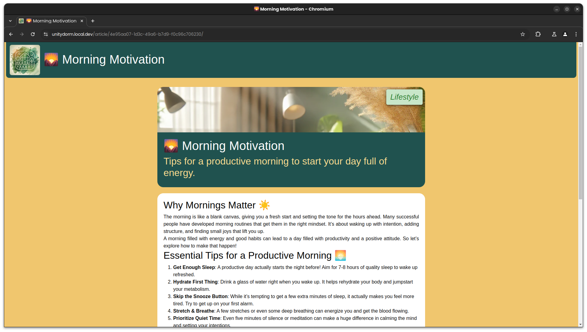
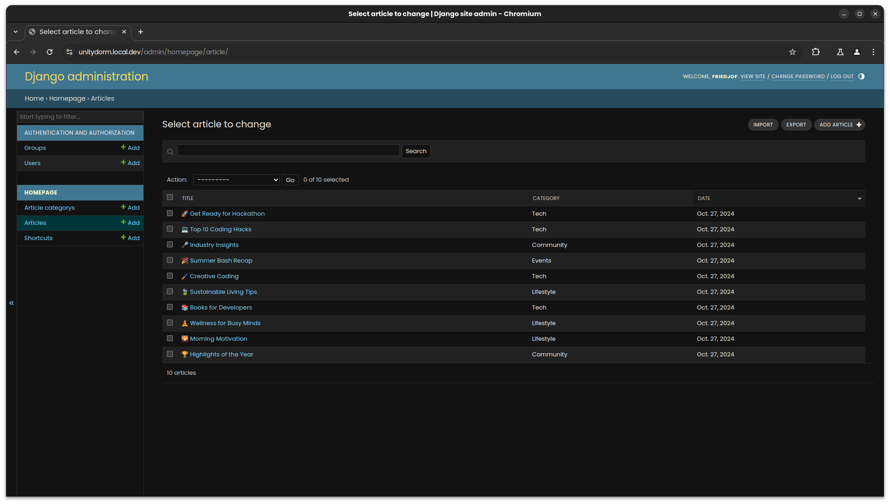

# UnityDorm 🌐

UnityDorm is a simple landing page and blog platform designed as a central hub for community members. Users can create "shortcuts" displayed as small icons in the upper section to quickly access frequently used links. Additionally, there is a feature for writing and publishing blog articles.

> **Note**: This is in development and may have bugs or incomplete features. Feel free to contribute to the project by submitting pull requests or issues.

## Features ✨

### 1. Shortcuts 🚀
- **Description**: Shortcuts are small icons in the upper section of the page, serving as quick links to external resources.
- **Customization**: Each shortcut can have a title, an image, and a link that can open in a new tab.
- **Purpose**: Shortcuts provide easy access to frequently used links for the community and offer a clear structure.

### 2. Blog Articles 📝
- **Description**: Users can write and publish blog articles organized into various categories.
- **Customization**: Blog articles have a title, a short description, and detailed content. An image and a category can be added for each post.
- **Purpose**: The blog feature provides a platform for sharing news, opinions, or other content with the community.

> **The article text** can be written in Markdown format, allowing for easy formatting and styling. Then the content is rendered as HTML on the frontend.

## Screenshots 📸

<table>
  <tr>
    <td></td>
    <td></td>
    <td></td>
  </tr>
</table>

_This screenshot shows the homepage with shortcuts and blog articles, an article with detailed content, and the admin panel for managing articles._

## Installation ⚙️

1. Clone the repository:
   ```bash
   git clone https://github.com/YourUsername/UnityDorm.git
   ```
2. Install the required dependencies:
   ```bash
   pip install -r requirements.txt
   ```
3. Run migrations:
   ```bash
   python manage.py migrate
   ```
4. Start the server:
   ```bash
   python manage.py runserver
   ```

## Usage 🖥️

- **Admin Interface**: The admin interface allows you to manage shortcuts and blog articles. Log in at `/admin` to add shortcuts or create and edit blog articles.
- **Homepage**: The homepage displays a list of shortcuts and blog articles. Users can access relevant content through the links in the header section.

## Makefile Commands 🛠️

Here are the available `make` commands for the project:

- **migrations**: Creates new migration files.
- **migrate**: Runs database migrations.
- **requirements**: Updates `requirements.txt` with the current dependencies.
- **build**: Builds the Docker image without cache.
- **up**: Starts the Docker container.
- **down**: Stops the Docker container.
- **logs**: Shows logs of the Docker container.
- **restart**: Stops and restarts the container.
- **demo**: Runs `build` and `up` in sequence.
- **clean**: Stops the container and cleans up unused Docker images.
- **release**: Creates a new release version (including Git tagging and push).
- **version**: Updates `version.txt` with the latest Git tag.
- **admin**: Creates a new Django superuser.
- **shell**: Starts the Django shell.

## Contributing 🤝

Contributions are welcome! Feel free to submit a pull request if you have any improvements or new features to suggest.

## License 📜

This project is licensed under the GPL-3.0 license. For more details, see the [LICENSE](LICENSE) file.

---

Enjoy using UnityDorm! 🎉